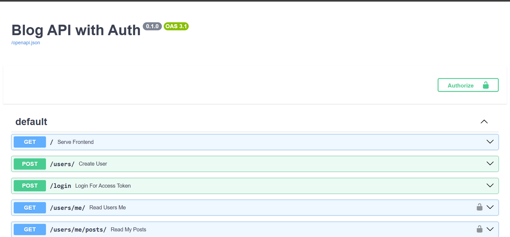
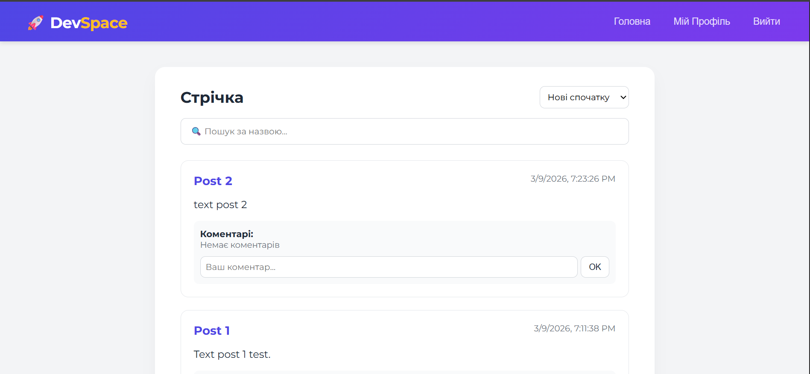
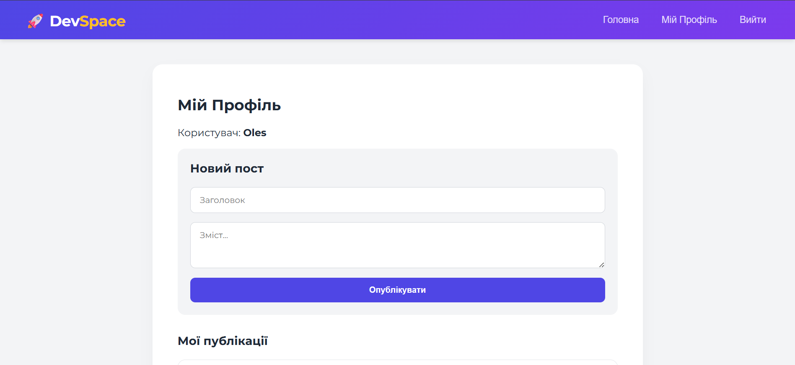
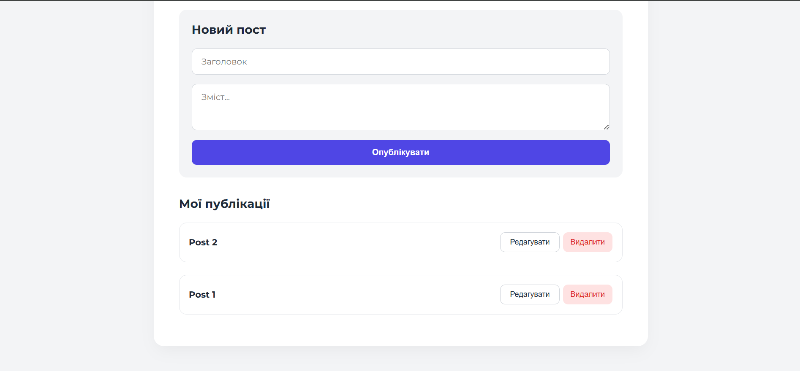

#  DevSpace - Full-stack Blog Application (Lab 2 & 3)

**DevSpace** — це сучасний вебзастосунок для публікації постів, реалізований як **SPA (Single Page Application)**. Проєкт демонструє роботу з REST API на бекенді та динамічну взаємодію з інтерфейсом на фронтенді.

---

##  Функціональні можливості

###  Публічна частина (Головна сторінка)
- **Стрічка постів:** Автоматичне завантаження всіх публікацій із бази даних.
- **Пошук:** Миттєва фільтрація за заголовком (пошук відбувається на рівні БД).
- **Сортування:** Вибір порядку відображення (нові, старі або за алфавітом).
- **Коментарі:** Можливість переглядати обговорення під кожним постом.

###  Авторизація та Безпека
- **JWT-токені:** Захист приватних маршрутів та збереження сесії в `localStorage`.
- **Bcrypt:** Надійне хешування паролів перед збереженням у базу даних.
- **Toast Notifications:** Плавні спливаючі повідомлення про успіх або помилки (замість стандартних `alert`).

###  Особистий кабінет (Профіль)
- **Створення контенту:** Зручна форма для публікації нових постів.
- **Повний CRUD:** Можливість **редагувати (PUT)** та **видаляти (DELETE)** власні пости.
- **Модальні вікна:** Інтерфейс редагування відкривається поверх сторінки для зручності.

---

##  Документація API (Swagger)

FastAPI автоматично генерує інтерактивну документацію до всіх ендпоінтів бекенду. Після запуску сервера вона доступна за посиланням:  
 [http://127.0.0.1:8000/docs](http://127.0.0.1:8000/docs)

###  Як протестувати захищені ендпоінти
Оскільки API використовує JWT-авторизацію, для тестування приватних запитів виконайте наступне:
1. Знайдіть запит **`POST /login`**, натисніть *Try it out* і введіть логін/пароль.
2. Після виконання (`Execute`) скопіюйте отриманий `access_token`.
3. Натисніть кнопку **Authorize** у самому верху сторінки.
4. Вставте скопійований токен і натисніть **Authorize**.

> **Інтерфейс Swagger UI**
> 

---

### Головна сторінка та Пошук


### Редагування постів в профілі



---

##  Технологічний стек

- **Backend:** FastAPI, SQLAlchemy ORM, SQLite.
- **Security:** JWT (JSON Web Tokens), Passlib (Bcrypt).
- **Frontend:** Vanilla JavaScript (ES6+), HTML5, CSS3 (Montserrat Font).


---

##  Керування базою даних (`blog.db`)

Взаємодія з даними реалізована через **SQLAlchemy**, що дозволяє керувати БД за допомогою Python-об'єктів без написання прямих SQL-запитів.

**Таблиці в базі даних:**
1. **`users`**: ID, логін, пошта, хешований пароль.
2. **`posts`**: Заголовок, текст, дата створення (`created_at`), зв'язок з автором (`owner_id`).
3. **`comments`**: Текст, зв'язок з постом та автором.


---

##  Як запустити проєкт

1. **Встановіть залежності:**
   ```bash
   pip install fastapi uvicorn sqlalchemy passlib[bcrypt] "python-jose[cryptography]" python-multipart
   pip install bcrypt==4.0.1

2. **Запустіть сервер**
   ```bash
   uvicorn main:app --reload
3. **Відкрийте у браузері:
http://127.0.0.1:8000**